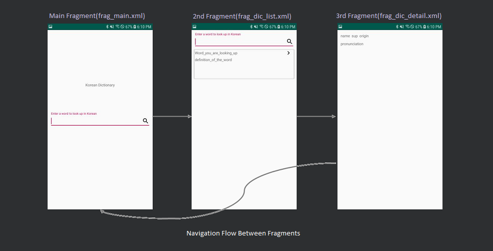
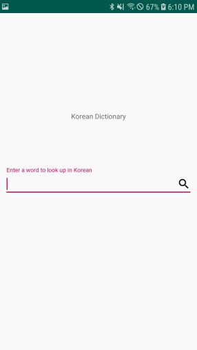
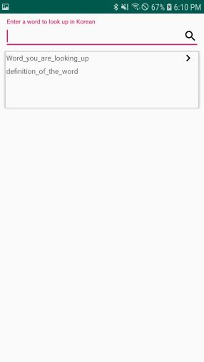
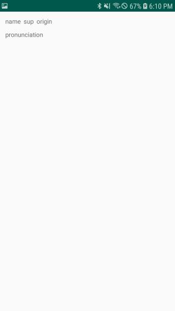
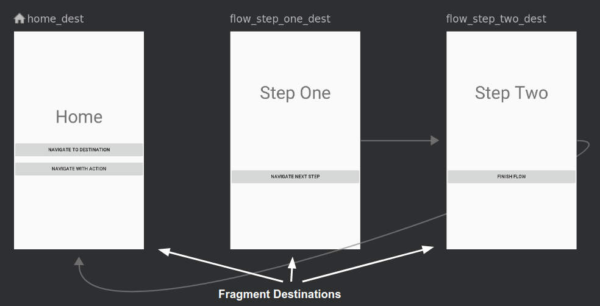

summary: Building a View - Kotlin
id: building-a-view
categories:Android MVVM Architecture
status: Published
authors: Sean Jin Han
Feedback Link: https://sagaj.io

# Building an android app with MVVM Architecture(1) - UI

## Welcome
Duration: 1

This is the first part of android MVVM(Model-View-ViewModel) implementation tutorial that will cover only UI implementation portion with no ViewModel or Model involved. 

For complete detail about this tutorial, see the *[MVVM tutorial](www.ubimemes.com)*

Positive
: **Note**: This tutorial is intended to help beginners to understand how android MVVM works and if you are already familiar with android basics, you may want to skip this part and go to next tutorial - ViewModel.


`nano`
[Ubimemes](http://www.ubimemes.com)


If you run into any issues (code bugs, grammatical errors, unclear wording, etc.) as you work through this codelab, please report the issue via the 'Report a mistake' link in the lower left corner of the codelab.

## Introduction
Duration: 3

<!-- 안드로이드 View(UI)는 Activity와 Fragment로 구성됨. -->
Android app's UI consists of at least one Activity and Fragments.
A Fragment is a self-contained component with its own user interface (UI) and lifecycle that can be reused in different parts of an app's UI. (A Fragment can also be used without a UI, in order to retain values across configuration changes, but this tutorial does not cover that usage.)

A Fragment can be a static part of the UI of an Activity, which means that the Fragment remains on the screen during the entire lifecycle of the Activity. However, the UI of an Activity may be more effective if it adds or removes the Fragment dynamically while the Activity is running.

One example of a dynamic Fragment is the DatePicker object, which is an instance of DialogFragment, a subclass of Fragment. The date picker displays a dialog window floating on top of its Activity window when a user taps a button or an action occurs. The user can click OK or Cancel to close the Fragment.


However, with using Navigation Component, it is suggested to build an app with only one Activity with fragments in order to let Navigation Contoller handle the navigation. Especially for beginners it will be a good appoach to start and this tutorial is also follow the recommendation.

building a view only - no data is attached at this step
You'll learn about Navigation Component

### What you should already know
You should be able to:
- Create and run apps in Android Studio.
- Use the layout editor to create a UI with a ConstraintLayout

### What you'll learn
- Add a Fragment to the layout of an Activity
- How to create Navigation XML
- How to make Fragments linked together
- How to use Navigation Controller

### What you'll do
- Create an Activity as a main UI container.
- Create Fragments to use as a UI element.
- Add interactive elements to the Fragments that users can navigate among them
- Add a RecyclerView to a fragment to show list data.

## App overview
Duration: 1

<!-- ## Task 1. Create an Activity and include Fragments 
Duration: 10 -->
With this tutorial, you'll build an app looking like below.


You'll build it with one Activity and three Fragments and taste of Navigation Component. 

<!-- 
1개의 Activity와 3개의 Fragment로 구성되는 사전 검색 앱을 구현해 볼 것이다.
UI(View)의 구현인 만큼 Data binding 없이 Navigation Component를 사용한 UI의 구현에 대해서만 설명할 것임. 안드로이드 입문자를 위한 파트이므로, 초보적인 지식을 가지고 있는 사람은 스킵하고 다음 Tutorial(ViewModel with Repository)로 이동해도 무방하겠다.
 -->

<!--  -->

Positive
: As the purpose of this tutorial is to demonstrate how MVVM architecture can be implemented, any extra codes that are not directly relavant to MVVM architecture will not be covered.
<!-- 
 의 명확한 demonstration을 위해 일체의 데이터 연동 없이 UI(View)의 천이만 구현함
자동 생성되는 코드를 최대한 유용하여 Navigation Component를 이해하는 데 포커스 함
 -->

<!-- 

 -->


## Update gradle files
Duration: 3

To use Navigation Component in Kotlin, you need to add dependency to `build.graddle` under `app` folder not the one under your project root folder. Kotlin version of navigation-fragment will look like below.

```
def nav_version = '2.3.0-alpha01'           // define the version of navigation-fragment
...
implementation "androidx.navigation:navigation-fragment-ktx:$nav_version"
```

Your `build.gradle` file looks like below.
```
dependencies {
    def nav_version = '2.3.0-alpha01'

    implementation fileTree(dir: 'libs', include: ['*.jar'])
    implementation "org.jetbrains.kotlin:kotlin-stdlib-jdk7:$kotlin_version"
    implementation 'androidx.appcompat:appcompat:1.0.2'
    implementation 'androidx.core:core-ktx:1.0.2'
    implementation 'androidx.constraintlayout:constraintlayout:1.1.3'
    implementation 'com.google.android.material:material:1.0.0'

    // Kotlin
    implementation "androidx.navigation:navigation-fragment-ktx:$nav_version"

    implementation 'androidx.legacy:legacy-support-v4:1.0.0'
    implementation 'androidx.lifecycle:lifecycle-extensions:2.0.0'
    implementation 'androidx.lifecycle:lifecycle-viewmodel-ktx:2.0.0'
    testImplementation 'junit:junit:4.12'
    androidTestImplementation 'androidx.test.ext:junit:1.1.0'
    androidTestImplementation 'androidx.test.espresso:espresso-core:3.1.1'
}

```
Negative
: **Note** This tutorial is experimented on version 2.3.0-alpha01 of navigation-fragment and if you use different version of it, the configuration may be slightly different. 


## Create an Activity
Duration: 10

### Create MainActivity

Android app needs to have at least one Activity. You can create an Activity easily by follow Android Studio's one of the project templates. You'll choose basic activity to focus on understanding MVVM.

You'll also add Navigation Controller to the Activity to let it control your app's navigation.

<!-- 앱은 최소한 하나의 Activity를 가지며, 안드로이드 스튜디오를 통해 자동 생성되는 코드를 아무 변경 없이 XML layout 파일만 변경하여 Navigation component를 통한 화면 Flow의 구현을 설명하기로 한다. -->


(그림 - 안드로이드 스튜디오 캡쳐 화면)
Based on the version of Android Studio you are using, the generated code may be slightly different but basically it will look like below.
<!-- 
위에 설명한대로 자동 생성된 코드 그대로이며 안드로이드 스튜디오 버전에 따라 다소 차이는 있을 수 있으나 아래와 같은 코드가 될 것이다.
 -->

```
class MainActivity : AppCompatActivity() {

    override fun onCreate(savedInstanceState: Bundle?) {
        super.onCreate(savedInstanceState)
        setContentView(R.layout.activity_main)
    }
}
```
### Create XML layout

자동 생성된 layout file (activity_main.xml)을 아래와 같이 수정한다.

<!-- delete 'Hello World' TextView and add navigation framework -->

Your `activity_main.xml` file looks like below.
```
<?xml version="1.0" encoding="utf-8"?>
<androidx.constraintlayout.widget.ConstraintLayout 
    xmlns:android="http://schemas.android.com/apk/res/android"
    xmlns:app="http://schemas.android.com/apk/res-auto"
    xmlns:tools="http://schemas.android.com/tools"
    android:layout_width="match_parent"
    android:layout_height="match_parent"
    tools:context=".MainActivity">

    <fragment
        android:id="@+id/nav_host_fragment"
        android:name="androidx.navigation.fragment.NavHostFragment"
        app:layout_constraintBottom_toBottomOf="parent"
        app:defaultNavHost="true"
        app:navGraph="@navigation/main"
        android:layout_width="match_parent"
        android:layout_height="match_parent" />

</androidx.constraintlayout.widget.ConstraintLayout>
```

positive
: Android Studio gives you an error for `NavHostFragment` since you didn't update gradle files for Android Navigation component yet. Later in this tutorial, you will update gradle files and the error will be gone.

## Create Main Fragment
Duration: 5

### Write a Kotlin class for Main Fragment(MainFragment.kt)

You'll add a ClickListener for a search

```
val ibtnSearch = view.findViewById<ImageButton>(R.id.ibtnSearch)

ibtnSearch.setOnClickListener{
    findNavController(view).navigate(R.id.wordListFragment, null)
}
```

Your `MainFragment.kt` file looks like below.

```
class MainFragment : Fragment() {

    override fun onCreateView(
        inflater: LayoutInflater, container: ViewGroup?,
        savedInstanceState: Bundle?
    ): View? {
        return inflater.inflate(R.layout.frag_main, container, false)
    }

    override fun onViewCreated(view: View, savedInstanceState: Bundle?) {
        super.onViewCreated(view, savedInstanceState)

        val ibtnSearch = view.findViewById<ImageButton>(R.id.ibtnSearch)

        ibtnSearch.setOnClickListener{
            findNavController(view).navigate(R.id.wordListFragment, null)
        }
    }
}
```

Positive
: Android Studio gives you an error for navigate since you didn't update gradle files for Android Navigation component yet. Later in this tutorial, you will update gradle files and the error will be gone.

### Create an XML layout for Main Fragment. (frag_main.xml)

```
<?xml version="1.0" encoding="utf-8"?>
<androidx.constraintlayout.widget.ConstraintLayout
    xmlns:android="http://schemas.android.com/apk/res/android"
    xmlns:app="http://schemas.android.com/apk/res-auto"
    xmlns:tools="http://schemas.android.com/tools"
    android:layout_width="match_parent"
    android:layout_height="match_parent">

    <TextView
        android:layout_width="wrap_content"
        android:layout_height="wrap_content"
        android:text="Korean Dictionary"
        app:layout_constraintVertical_bias="0.30"
        app:layout_constraintBottom_toBottomOf="parent"
        app:layout_constraintLeft_toLeftOf="parent"
        app:layout_constraintRight_toRightOf="parent"
        app:layout_constraintTop_toTopOf="parent" />

    <LinearLayout
        android:orientation="horizontal"
        android:id="@+id/textInputLayout"
        android:layout_width="match_parent"
        android:layout_height="wrap_content"
        android:gravity="center_vertical"
        app:layout_constraintTop_toTopOf="parent"
        app:layout_constraintBottom_toBottomOf="parent"
        app:layout_constraintLeft_toLeftOf="parent">

        <EditText
            android:id="@+id/etSearch"
            android:layout_width="match_parent"
            android:layout_height="match_parent"
            android:gravity="center_vertical"
            android:imeOptions="actionSearch"
            android:text="" />

        <ImageButton
            android:layout_width="wrap_content"
            android:layout_height="wrap_content"
            android:id="@+id/ibtnSearch"
            android:layout_marginRight="10dp"
            android:background="@drawable/ic_search_24px"
            android:tint="@android:color/background_light" />
    </LinearLayout>
</androidx.constraintlayout.widget.ConstraintLayout>
```

## Create 2nd Fragment
Duration: 10

### Write a Kotlin class for Second Fragment(WordList.kt)

```
class WordListFragment : Fragment() {

    private lateinit var adapter: WordListAdapter

    override fun onCreateView(
        inflater: LayoutInflater,
        container: ViewGroup?,
        savedInstanceState: Bundle?
    ): View? {
        return LayoutInflater.from(requireActivity()).inflate(R.layout.frag_dic_list, container, false)
    }

    override fun onViewCreated(view: View, savedInstanceState: Bundle?) {
        adapter = WordListAdapter(requireActivity().applicationContext)
        val rv = view.findViewById<RecyclerView>(R.id.recyclerview_wordlist)
        rv.setHasFixedSize(true)
        rv.layoutManager = LinearLayoutManager(context)
        rv.adapter = adapter
    }

}
```

You will also need an adapter for recyclerView and it will look like below.

```
class WordListAdapter internal constructor (
    private val context: Context
) : RecyclerView.Adapter<RecyclerView.ViewHolder>(){

    inner class ViewHolder(itemView: View) : RecyclerView.ViewHolder(itemView) {
        val cardView: ConstraintLayout =itemView.findViewById(R.id.cardView)
    }

    override fun onCreateViewHolder(parent: ViewGroup, viewType: Int): RecyclerView.ViewHolder {
        val inflater: LayoutInflater = LayoutInflater.from(context)
        val itemView = inflater.inflate(R.layout.frag_dic_list_item, parent, false)
        return ViewHolder(itemView)
    }

    override fun onBindViewHolder(holder: RecyclerView.ViewHolder, position: Int) {

        holder as ViewHolder

        holder.cardView.setOnClickListener {
            Navigation.findNavController(it)
                .navigate(R.id.wordDetailFragment, null)

        }
    }

    override fun getItemCount() : Int {
        return 3        // this will be replaced with actual data in next tutorial
    }
}
```

negative
: `return 3` is set to demonstrate listview shows 3 items which will be replaced with real data in next tutorial - How to write ViewModel

### Create an XML layout for 2nd Fragment (frag_dic_list.xml).

```
<?xml version="1.0" encoding="utf-8"?>
<androidx.constraintlayout.widget.ConstraintLayout android:layout_width="match_parent"
    android:layout_height="match_parent"
    xmlns:app="http://schemas.android.com/apk/res-auto"
    xmlns:tools="http://schemas.android.com/tools"
    android:id="@+id/constraintLayout"
    xmlns:android="http://schemas.android.com/apk/res/android">

    <androidx.recyclerview.widget.RecyclerView
        android:id="@+id/recyclerview_wordlist"
        android:layout_width="0dp"
        android:layout_height="0dp"
        app:layout_constraintTop_toBottomOf="@id/textInputLayout"
        app:layout_constraintLeft_toLeftOf="parent"
        app:layout_constraintRight_toRightOf="parent"
        app:layout_constraintBottom_toBottomOf="parent" />

</androidx.constraintlayout.widget.ConstraintLayout>
```
You will also need an adapter for recyclerView and it will look like below.
```
<?xml version="1.0" encoding="utf-8"?>
<androidx.cardview.widget.CardView
    xmlns:android="http://schemas.android.com/apk/res/android"
    xmlns:app="http://schemas.android.com/apk/res-auto"
    app:cardBackgroundColor="@android:color/transparent"
    android:layout_width="match_parent"
    android:layout_height="wrap_content" >

    <androidx.constraintlayout.widget.ConstraintLayout
        android:id="@+id/cardView"
        android:layout_width="match_parent"
        android:layout_height="match_parent">
        <TextView
            android:id="@+id/word"
            android:layout_width="wrap_content"
            android:layout_height="wrap_content"
            android:text="word"
            app:layout_constraintLeft_toLeftOf="parent"
            app:layout_constraintTop_toTopOf="parent" />

        <TextView
            android:id="@+id/wdefinition"
            android:layout_width="0dp"
            android:layout_height="wrap_content"
            android:maxLines="3"
            android:padding="@dimen/default_padding"
            android:text="definition"
            app:layout_constraintLeft_toLeftOf="parent"
            app:layout_constraintRight_toRightOf="parent"
            app:layout_constraintTop_toBottomOf="@+id/word" />
    </androidx.constraintlayout.widget.ConstraintLayout>
</androidx.cardview.widget.CardView>
```
## Create 3rd Fragment
Duration: 5

### Write a Kotlin class for Third Fragment(WordDetail.kt)
You will use the genetated code as is without a touch.

```
class WordDetailFragment : Fragment() {

    override fun onCreateView(
        inflater: LayoutInflater,
        container: ViewGroup?,
        savedInstanceState: Bundle?
    ): View? {
        return inflater.inflate(R.layout.frag_dic_detail, container, false)
    }
}
```

### Create a XML layout for 3rd Fragment (frag_dic_detail.xml)
```
<?xml version="1.0" encoding="utf-8"?>
<androidx.constraintlayout.widget.ConstraintLayout
    android:layout_width="match_parent"
    android:layout_height="wrap_content"
    xmlns:android="http://schemas.android.com/apk/res/android"
    xmlns:app="http://schemas.android.com/apk/res-auto">

    <TextView
        android:id="@+id/word"
        android:text="word"
        android:layout_width="match_parent"
        android:layout_height="wrap_content"
        app:layout_constraintTop_toTopOf="parent" />

    <TextView
        android:id="@+id/pronunciation"
        android:text="pronunciation"
        android:layout_width="match_parent"
        android:layout_height="wrap_content"
        app:layout_constraintTop_toBottomOf="@+id/word"/>

    <TextView
        android:id="@+id/definition"
        android:text="definition"
        android:layout_width="match_parent"
        android:layout_height="wrap_content"
        android:padding="@dimen/default_padding"
        app:layout_constraintTop_toBottomOf="@+id/pronunciation"/>

</androidx.constraintlayout.widget.ConstraintLayout>
```
## Create a Navigation layout
Duration: 10

Let's get the fragments work together.
- Automatic handling of fragment transactions
- Android Studio tooling for visualizing and editing the navigation flow of an app


<!--  -->

### Create Navigation XML
```
<navigation xmlns:android="http://schemas.android.com/apk/res/android"
    xmlns:app="http://schemas.android.com/apk/res-auto"
    app:startDestination="@id/main">
    <fragment
        android:id="@+id/main"
        android:name="com.ubimemes.samples.krdic.MainFragment"
        android:label="MainFragment">
        <action
            android:id="@+id/action_mainFragment_to_wordListFragment"
            app:destination="@id/wordListFragment" />
    </fragment>

    <fragment
        android:id="@+id/wordListFragment"
        android:name="com.ubimemes.samples.krdic.ui.list.WordListFragment"
        android:label="WordListFragment">
        <action
            android:id="@+id/action_wordListFragment_to_wordDetailFragment"
            app:destination="@id/wordDetailFragment" />
    </fragment>

    <fragment
        android:id="@+id/wordDetailFragment"
        android:name="com.ubimemes.samples.krdic.ui.detail.WordDetailFragment"
        android:label="WordDetailFragment" />
</navigation>
```

### codes Navigations between Fragments

1. code to navigate from Main Fragment to 2nd Fragment
```
        ibtnSearch.setOnClickListener{
            findNavController(view).navigate(R.id.wordListFragment, null)
        }

```
2. code to navigate from 2nd Fragment to 3rd Fragment
```
        holder.cardView.setOnClickListener {
            Navigation.findNavController(it)
                .navigate(R.id.wordDetailFragment, null)

        }

```
3. code to navigate from 3rd Fragment to Main Fragment
```
            Navigation.findNavController(it)
                .navigate(R.id.mainFragment, null)

```


## Summary
Duration: 1

## Further explorations (or Learn more)
Duration: 10

- EditText
- some decoration
